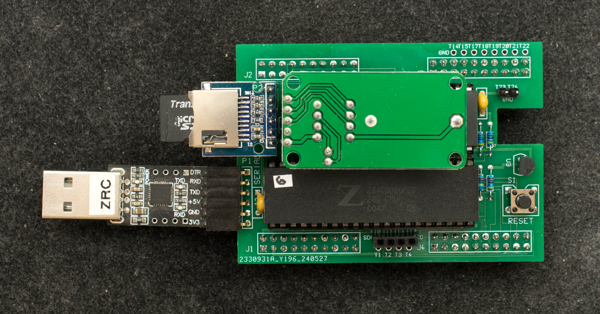
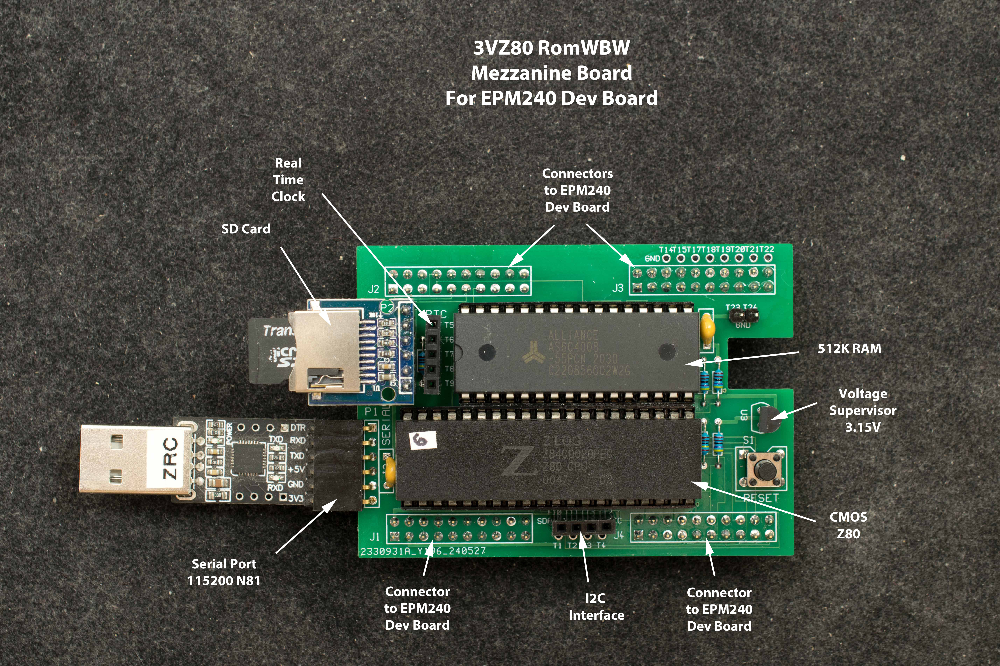
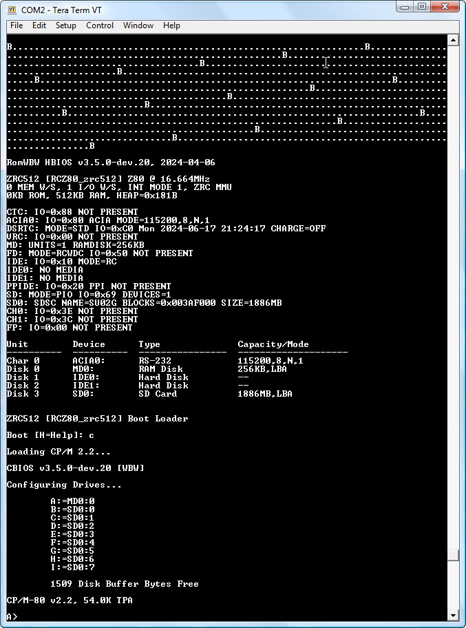

# Z80 Rev0 Mezzanine Board for EPM240 Dev Board

**Note, Rev0 of Z80 Mezzanine board is superseded by [rev1.1](../Rev1) of 3V Z80 Mezzanine board**
### Introduction
While Z80 is specified for 5V operation, selected CMOS Z80 are capable of running at 3.3V. This mezzanine board hosts such Z80 plus a 512K RAM and plugs on top of the EPM240 development board. The two-board Z80 computer can run RomWBW.

### Features
- CMOS Z80 selected for 3.3V operation
- 512K RAM
- 512 byte flash embedded in EPM240 can boot RomWBW
- ACIA emulation in EPM240
- SD card interface
- RTC module based on DS1302
- I2C interface
- RomWBW capable

### Theory of Operation
Boot from embedded 512-byte flash, etc, etc…place holder.

### Design Files
- Schematic
- Gerber photoplot files
- EPM240 design files
  - RomWBW SD bootstrap code resided in EP240's embedded flash
- EPM240 design files with fast SD bootstrap (6 seconds), but no RAM disk at drive A
- Bill of Materials

### Software
RomWBW image for 3VZ80. The RomWBW will be booted at power up. It takes 23 seconds to load and boot RomWBW from reset.

