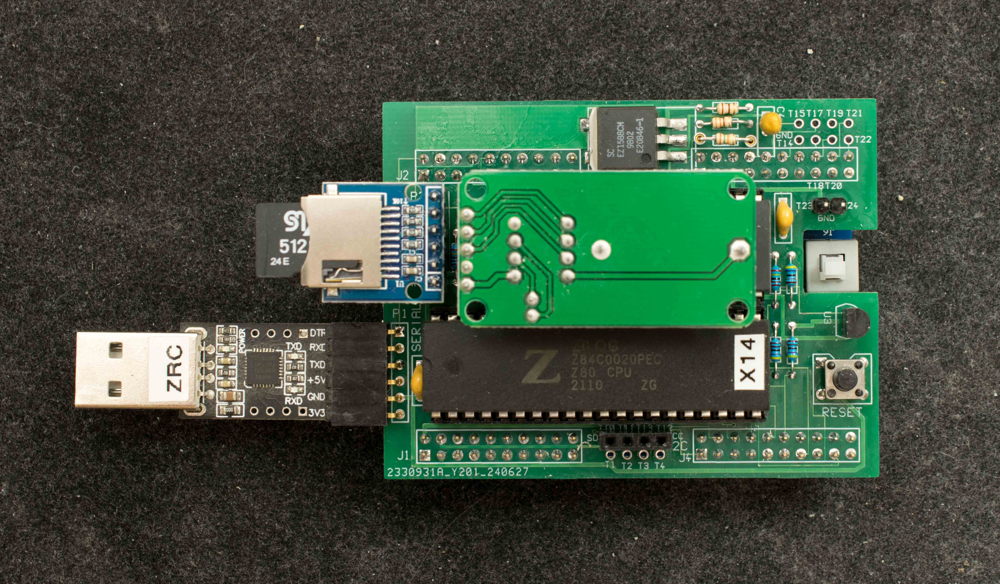
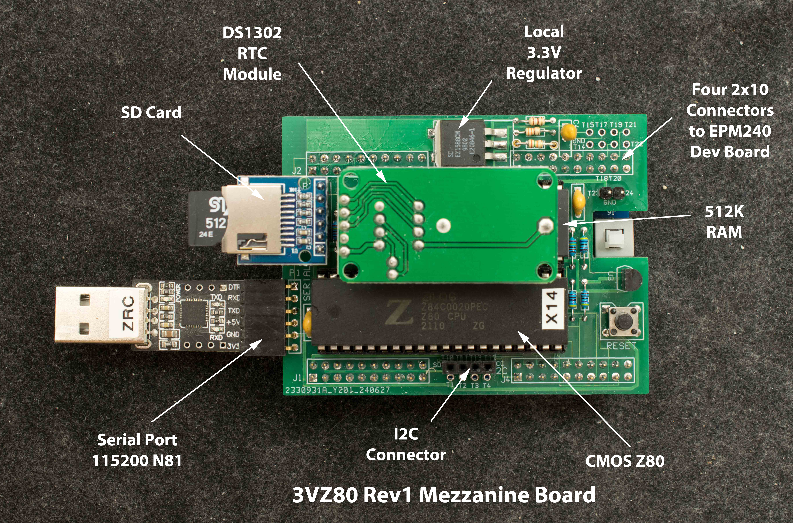
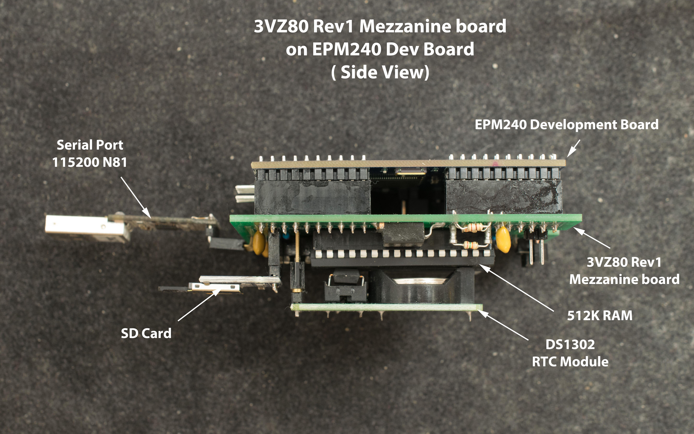

# Z80 Rev1.1 Mezzanine Board for EPM240 Dev Board

While Z80 is specified for 5V operation, selected CMOS Z80 are capable of running at 3.3V. This mezzanine board hosts such Z80 plus a 512K RAM and plugs on top of the EPM240 development board. The two-board Z80 computer can run RomWBW. This is link to rev0 of 3V Z80 which does not have the local 3.3V regulator.

### Features
- CMOS Z80 selected for 3.3V operation
- 512K RAM
- 512 byte flash embedded in EPM240 can boot RomWBW
- ACIA emulation in EPM240
- SD card interface
- RTC module based on DS1302
- I2C interface
- RomWBW capable
- Local 3.3V regulator adjusted to 3.5V

### Theory of Operation
Boot from embedded 512-byte flash, etc, etc…place holder.

### Design Files
- Schematic

- Gerber photoplot files

- EPM240 design files

- RomWBW SD bootstrap code resided in EP240's embedded flash
- EPM240 design files with fast SD bootstrap (6 seconds), but no RAM disk at drive A

- Bill of Materials

### Software
RomWBW image for 3VZ80. The RomWBW will be booted at power up. It takes 23 seconds to load and boot RomWBW from reset. Due to limited ROM code space in EPM240, only SD cards up to 2G are supported. Another word, SDHC (2-32GB) and SDXC (32GB-2TB) are not supported

Note, Serial port for RomWBW will work without hardware handshake, however to transfer files using XM.COM in RomWBW will require a serial port with hardware handshake capability and terminal emulation that supports hardware handshake such as TeraTerm. The handshake signal needs to be CTS (not DTR). Picture below shows modifications to the common 6-pin CP2102 USB-serial adapter to enable hardware handshake.

